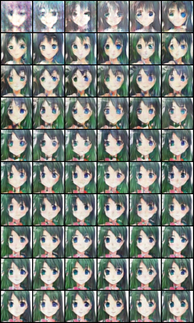

# DCGAN-PyTorch 项目说明

## 项目简介

本项目实现了基于 PyTorch 的深度卷积生成对抗网络（DCGAN），用于无监督学习和图像生成。代码结构清晰，适合 GAN/深度学习初学者学习和实验。项目代码基于[代码原作者仓库](https://github.com/gxwangupc/DCGAN-PyTorch)，进行修改。
数据源采用[70,171 张动漫头像图片](https://download.mindspore.cn/dataset/Faces/faces.zip)，图片大小均为 96\*96。

## 主要功能

- 支持人脸数据集（faces）训练和测试
- 训练过程自动保存模型和生成图片
- 损失曲线自动保存并可视化
- 固定随机种子，保证实验可复现
- 支持多进程数据加载加速训练

## 环境

- conda activate cartoon （本人的虚拟环境名字）
- Python 3.11.11
- PyTorch
- torchvision
- matplotlib
- 其他依赖见 environment.yml
- GPU 4060 laptop

## 目录结构

```
DCGAN-PyTorch/
├── main.py                      # 主训练脚本
├── test_main.py                 # 测试脚本
├── Generator.py                 # 生成器网络
├── Discriminator.py             # 判别器网络
├── plot_loss.py                 # 损失曲线可视化
├── download_lsun.py             # LSUN数据集下载工具(原仓库数据集代码，本实验并不使用)
├── crop_from_grid.py            # 单张图片裁剪工具
├── batch_crop_from_grid.py      # 批量图片裁剪工具
├── paper_grid.py                # 网格图生成脚本
├── paper_comparison.py          # 多epoch对比图生成脚本
├── paper_progression.py         # 逐步演化图生成脚本
├── paper_gif.py                 # GIF动画生成脚本
├── faces/                       # 人脸图片数据集（需自行准备）
│   └── faces/                   # 动漫头像图片子文件夹
│       └── class1/              # 图片类别文件夹
│           ├── 0.jpg
│           ├── 1.jpg
│           └── ...
├── results/                     # 训练结果（模型和图片）
│   ├── netG_epoch_xxx.pth       # 生成器模型
│   ├── netD_epoch_xxx.pth       # 判别器模型
│   ├── fake_samples_epoch_xxx.png      # 训练中生成的图片
│   ├── fake_samples_epoch_end_xxx.png  # 每个epoch结束时生成的图片
│   ├── single_sample_epoch_xxx.png     # 单一噪声生成的图片
│   ├── single_real_sample.png          # 对比用真实图片
│   ├── losses.csv                      # 损失记录
│   └── loss_curve.png                  # 损失曲线图
├── crop/                        # 批量裁剪后的小图
├── paper/                       # 论文/展示用图片输出目录
│   ├── grid.png                 # 网格图
│   ├── comparison.png           # 多epoch对比图
│   ├── progression.png          # 逐步演化图
│   └── progression.gif          # 演化GIF动画
├── use_netG.py                  # 使用根目录 netG_epoch_59.pth 生成图片的脚本
├── .gitignore                   # Git忽略配置
├── README.md                    # 项目说明
├── environment.yml              # 环境配置文件
└── .idea/                       # IDE配置文件夹
```

## 快速开始

### 1. 数据准备

将[动漫头像](https://download.mindspore.cn/dataset/Faces/faces.zip)按如下结构放置（每个类别一个子文件夹）：

```
faces/
└── faces/
    └── class1/
        ├── 0.jpg
        ├── 1.jpg
        └── ...
```

### 2. 测试环境

```bash
python test_main.py
```

- 仅用部分数据进行快速测试。

### 3. 训练模型

一个 epoch 大概 10 分钟。

```bash
python main.py
```

- 训练结果和模型会保存在 `./results` 目录。

### 4. 可视化损失曲线

```bash
python plot_loss.py
```

- 生成 `results/loss_curve.png`。

### 5. 使用指定生成器模型生成图片

```bash
python use_netG.py --model_path ./netG_epoch_59.pth --output ./results/sample_from_59.png
```

- 使用根目录下的 `netG_epoch_59.pth` 生成图片，输出到指定路径。

## 效果展示

下图为本项目生成的部分结果示例：

**网格图（多张生成图片拼接）**


**多 epoch 对比图**


**逐步演化图**


**演化 GIF 动画**


### 使用 use_netG.py 生成图片

你可以直接使用根目录下的 `use_netG.py` 脚本，加载已训练好的生成器模型（如 `netG_epoch_59.pth`），快速生成图片：

```bash
python use_netG.py --model_path ./netG_epoch_59.pth --output ./sample_from_59.png
```

- 可通过 `--num` 参数指定生成图片数量，`--output` 指定输出路径。

## 参数说明（main.py）

- `--dataroot` 数据集根目录
- `--batch_size` 批大小（默认 128）
- `--img_size` 输入图片尺寸（默认 64）
- `--nepoch` 训练轮数（默认 10）
- `--cuda` 使用 GPU 训练
- 其他参数见 main.py 注释

## 复现性说明

- 项目已固定随机种子（42），保证每次运行结果一致。
- 多进程数据加载不会影响训练结果。

## 备注

- faces.zip 等大文件未纳入版本控制，请自行准备数据集。
- 如需扩展到其他数据集或网络结构，可参考 main.py 代码结构进行修改。

---

如有问题或建议，欢迎 issue 或 PR！
